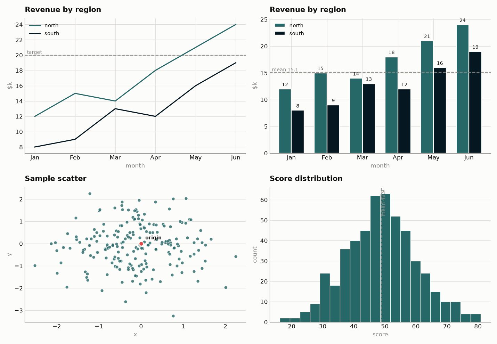

# CustomPlots

Nicer-looking charts than pandas' defaults — in one import.

pandas' built-in `.plot()` is great for a quick look, but the defaults are
noisy: heavy spines, cramped titles, a color cycle that isn't colorblind-safe.
`CustomPlots` is a tiny wrapper (under 200 lines) that applies a clean,
validated theme and gives you a handful of plotting helpers that take the same
pandas objects you already have.

## Install

```bash
pip install -e .
```

Requires `matplotlib` and `pandas`.

## Usage

```python
import pandas as pd
import CustomPlots as cust

df = pd.DataFrame(
    {"north": [12, 15, 14, 18, 21, 24], "south": [8, 9, 13, 12, 16, 19]},
    index=["Jan", "Feb", "Mar", "Apr", "May", "Jun"],
)

cust.line(df, title="Revenue by region", ylabel="$k")
```

The theme is applied automatically on `import CustomPlots`. If another library
resets matplotlib's style, call `cust.use()` again to reapply it.

### Helpers

| Function | Chart |
|----------|-------|
| `cust.line(data, ...)`    | line chart |
| `cust.bar(data, ...)`     | vertical bar chart |
| `cust.barh(data, ...)`    | horizontal bar chart |
| `cust.scatter(data, x, y, ...)` | scatter plot of two columns |
| `cust.hist(data, ...)`    | histogram |

Every helper accepts a pandas `Series` or `DataFrame`, optional `title`,
`xlabel`, `ylabel`, and an existing `ax` to draw into. Extra keyword arguments
pass straight through to matplotlib, and each returns the `Axes` so you can keep
customizing.

### Custom colors

Every helper takes an optional `colors` argument. Leave it out to use the
built-in colorblind-safe palette, or pass your own to override it. You can use
plain **color names** — no need to know hex codes:

```python
# one color per series, by name
cust.line(df, colors=["black", "orange"])
cust.bar(df, colors=["red", "green", "blue"])

# a single color (accepts a list or a bare string)
cust.hist(scores, colors="purple")

# hex codes work too, if you want an exact shade
cust.line(df, colors=["#111111", "#ff5500"])
```

Common names: `black`, `white`, `gray` (or `grey`), `red`, `orange`, `yellow`,
`green`, `blue`, `indigo`, `violet`, `purple`, `pink`, `brown`, `cyan`,
`magenta` — plus over a thousand more that matplotlib recognizes.

For multi-series charts (`line`, `bar`, `barh`) the colors are applied one per
series, in order. For single-color charts (`scatter`, `hist`) the first color
is used.

### Annotations

Every plot function returns its matplotlib `Axes`, and these helpers layer a
reference mark on top of it — so you can measure the data against a target,
a mean, or a range:

```python
ax = cust.bar(df, title="Revenue by region")

cust.constant_line(ax, 20, label="target")   # horizontal line to measure against
cust.mean_line(ax, df.values.ravel())         # dashed line at the mean, auto-labeled
cust.band(ax, 15, 25, label="goal range")     # shaded target range
cust.label_bars(ax)                            # print each bar's value on top
```

| Function | What it adds |
|----------|--------------|
| `cust.constant_line(ax, value, axis="y", label=...)` | a horizontal (or vertical, `axis="x"`) reference line |
| `cust.mean_line(ax, data, axis="y")` | a reference line at the mean of `data`, labeled with the value |
| `cust.band(ax, low, high, axis="y")` | a shaded target range between two values |
| `cust.add_point(ax, x, y, label=...)` | a highlighted marker at a single point |
| `cust.label_bars(ax, fmt="{:.0f}")` | value labels on the bars of a bar chart |

`constant_line`, `mean_line`, and `band` all take `axis="x"` to draw
vertically instead of horizontally (handy for marking a mean on a histogram).

## What the theme changes

- Colorblind-safe categorical palette, assigned in fixed order.
- Drops the top and right spines; soft horizontal gridlines only.
- Left-aligned, bold titles with breathing room.
- A legend appears automatically only when there are two or more series.

## Gallery

Run the demo to render every chart type into `examples/gallery.png`:

```bash
python examples/demo.py
```



## License

MIT — see [LICENSE](LICENSE).
